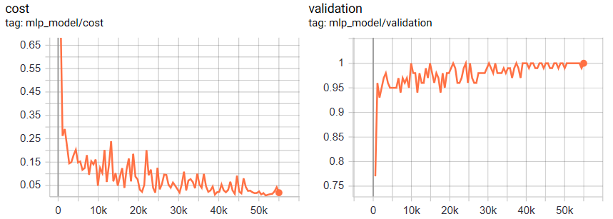
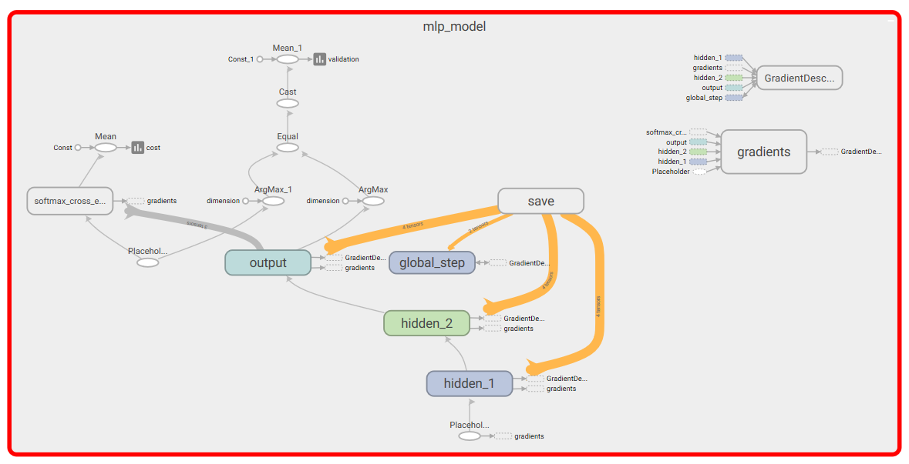
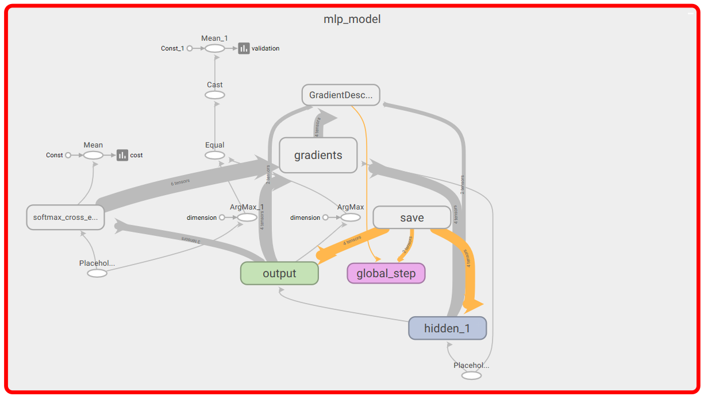

# Assignment 4

## Part 1
  
### Logistic regration in tensorflow

| Number of epochs  |Test Accuracy|
| ------------- |:-------------:|
| 60 | 0.9199 |
| 100 | 0.9218 |

## Part 2

### Multilayer perceptron - 2 layers

| Number of epochs  |Test Accuracy|
| ------------- |:-------------:|
| 100 | 0.9786 |
| 1000 | 0.9813 |

## Part 3

### Tensorboard

<h4>Done over the multilayer perceptron - 2 layers (100 epochs)

## Part 4

<h> Multilayer perceptron modified - 1 layer
 
 | Number of epochs  |Test Accuracy|
| ------------- |:-------------:|
| 100 | 0.9730 |
| 1000 | 0.9797 |

## Part 5

| Run no.       | 1-layer perceptron  (test accuracy)| 2-layer perceptron  (test accuracy) |
| ------------- |:-------------:| -----:|
|   1   | 0.9730 | 0.9786 |
| 2     | 0.8740|   0.9777 |
| 3 | 0.9729    |    0.9794|
| 4 | 0.8782      |    0.9790|
| 5 | 0.8635      |    0.9724 |
| **Average** | **0.91  0.05**    |   **0.977  0.003** |

| Tables        | Are           | Cool  |
| ------------- |:-------------:| -----:|
| col 3 is      | right-aligned | $1600 |
| col 2 is      | centered      |   $12 |
| zebra stripes | are neat      |    $1 |
