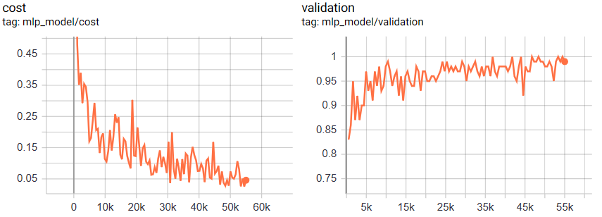

# Assignment 4

## Part 1
  
### Logistic regration in tensorflow

| Number of epochs  |Test Accuracy|
| ------------- |:-------------:|
| 60 | 0.9199 |
| 100 | 0.9218 |

## Part 2

### Multilayer perceptron - 2 layers

| Number of epochs  |Test Accuracy|
| ------------- |:-------------:|
| 100 | 0.9786 |
| 1000 | 0.9813 |

## Part 3

### Tensorboard

<h4>Done over the multilayer perceptron - 2 layers (100 epochs)

## Part 4

<h> Multilayer perceptron modified - 1 layer
 
 | Number of epochs  |Test Accuracy|
| ------------- |:-------------:|
| 100 | 0.9730 |
| 1000 | 0.9797 |

## Part 5

| Run no.       | 1-layer perceptron  (test accuracy)| 2-layer perceptron  (test accuracy) |
| ------------- |:-------------:| -----:|
|   1   | 0.9730 | 0.9786 |
| 2     | 0.8740|   0.9777 |
| 3 | 0.9729    |    0.9794|
| 4 | 0.8782      |    0.9790|
| 5 | 0.8635      |    0.9724 |
| **Average** | **0.91  0.05**    |   **0.977  0.003** |

**note: 256 HU un each layer and 100 epochs per run.**

## Question and Answers:

**1. Did running many more (1,000 vs 100) epochs yield better or worse results for the original multilayer perceptron?**

   **Answer:** Yield better performance, test accuracy of 0.98 vs. 0.97.

**2. Did the multilayer pereceptron do better or worse than logistic regression when you ran them both for 100 epochs?**
  
   **Answer:** Better, test accuracy of 0.97 vs. 0.92.

**3. Did decreasing the number of hidden layers reduce the success of the multilayer perceptron?**

   **Answer:** Yes, average test accuracy of 0.91 vs.∼0.97.  

**4. What general lesson might you deduce from your answers to these three questions?**

   **Answer:** from what I examined, I can conclude that more layers increase the average test accuracy of our model and decrease the standard deviation. Which means, that our model is more reliable and steadier with more layers. Additionally, we can see the difference between the scalar plots in part 3 (two layers) and part 4 (one layer). In part 3, the scalar values (coast and validation) are less noisy in comparison to the plots in part 4, means that using more layer will decrease the noise of these values    (based on what I examined).

